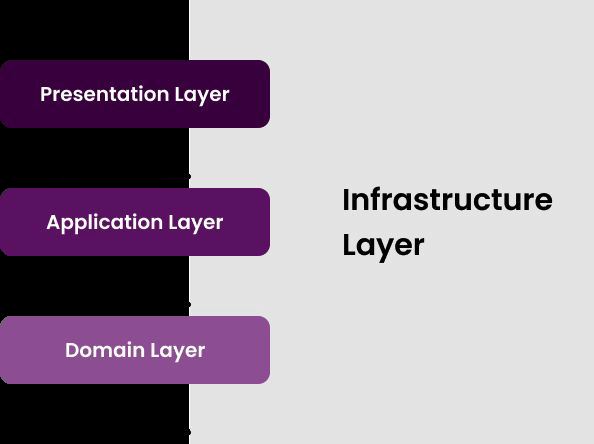

本系列文章，翻译至[Implementing Domain Driven Design](https://abp.io/books/implementing-domain-driven-design)
<!-- more -->

# 领域驱动设计是什么

领域驱动设计 (DDD) 是一种通过将实现连接到**不断发展的**模型来满足**复杂**需求的软件开发方法；

DDD 适用于**复杂领域**和**大型**应用，而不是简单的 CRUD 应用。它侧重于**核心领域逻辑**而不是基础架构细节。它有助于构建**灵活**、模块化和**可维护**的代码库。

## OOP 和 SOLID

实现 DDD 高度依赖于面向对象编程 (OOP) 和 [SOLID](https://en.wikipedia.org/wiki/SOLID) 原则。实际上，它**实现**并**扩展**了这些原则。因此，在真正实现 DDD 的同时，对 OOP 和 SOLID 的**良好理解**对您有很大帮助。

## DDD分层 和 简洁架构

基于领域驱动的解决方案有四个基本层；

业务逻辑分为领域层和应用层两层，包含不同种类的业务逻辑；

- **领域层**实现了领域/系统的核心、用例独立的业务逻辑。
- **应用层**基于领域实现应用的用例。用例可以被认为是用户界面 (UI) 上的用户交互。
- **表示层**包含应用程序的 UI 元素（页面、组件）。
- **基础设施层**通过实现对第三方库和系统的抽象和集成来支持其他层。

相同的分层可以如下图所示，称为 [Clean Architecture](https://8thlight.com/blog/uncle-bob/2012/08/13/the-clean-architecture.html)，有时也称为[Onion Architecture](https://jeffreypalermo.com/blog/the-onion-architecture-part-1/)：

在 Clean Architecture 中，每一层仅**依赖于直接位于其内部的层**。最独立的层显示在最里面的圆圈中，它是领域层。

## 核心构建块

DDD 主要**关注领域和应用层**，而忽略了表示和基础设施。它们被视为细节，业务层不应依赖于它们。

这并不意味着表示层和基础设施层不重要。它们非常重要。 UI 框架和数据库提供程序有自己的规则和最佳实践，您需要了解和应用这些规则和最佳实践。但是，这些不在 DDD 的主题中。

本节介绍领域和应用层的基本构建块。

### 领域层构建块

- **实体：**[实体](https://docs.abp.io/en/abp/latest/Entities)是一个对象，具有自己的属性（状态、数据）和实现在这些属性上执行的业务逻辑的方法。实体由其唯一标识符 (Id) 表示。具有不同 Id 的两个实体对象被视为不同的实体。
- **值对象：**[值对象](https://docs.abp.io/en/abp/latest/Value-Objects)是另一种由其属性而非唯一 ID 标识的域对象。这意味着具有相同属性的两个值对象被视为同一个对象。值对象通常被实现为不可变的，并且通常比实体简单得多。
- **聚合和聚合根：**[聚合](https://docs.abp.io/en/abp/latest/Entities)是由聚合根对象绑定在一起的一组对象（实体和值对象）。**聚合根**是具有一些附加职责的特定类型的实体。
- **存储库（接口）：**[存储库](https://docs.abp.io/en/abp/latest/Repositories)是一个类似集合的接口，领域和应用层使用它来访问数据持久性系统（数据库）。它对业务代码隐藏了 DBMS 的复杂性。领域层包含存储库的**接口**。
- **领域服务：**[领域服务](https://docs.abp.io/en/abp/latest/Domain-Services)是实现领域核心业务规则的无状态服务。实现依赖于多个聚合（实体）类型或一些外部服务的领域逻辑很有用。
- **规范：**[规范](https://docs.abp.io/en/abp/latest/Specifications)用于为实体和其他业务对象定义命名的、可重用的和可组合的过滤器。
- **领域事件：**[领域事件](https://docs.abp.io/en/abp/latest/Event-Bus)是一种在特定领域事件发生时以松散耦合的方式通知其他服务的方式。

### 应用层构建块

- **应用服务：**[应用服务](https://docs.abp.io/en/abp/latest/Application-Services)是实现应用用例的无状态服务。应用程序服务通常获取并返回 DTO。它由表示层使用。它使用和协调域对象来实现用例。用例通常被视为一个工作单元。
- **数据传输对象 (DTO)：**[DTO](https://docs.abp.io/en/abp/latest/Data-Transfer-Objects) 是一个简单的对象，没有任何业务逻辑，用于在应用程序层和表示层之间传输状态（数据）。
- **工作单元 (UOW)：**[工作单元](https://docs.abp.io/en/abp/latest/Unit-Of-Work)是原子性工作，应该作为事务单元来完成。 UOW 中的所有操作都应该在成功时一起提交或在任何一个失败时一起回滚。

