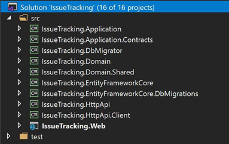
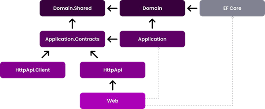
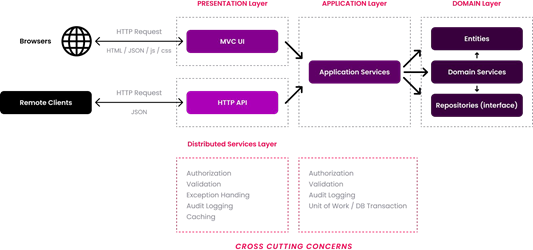

本系列文章，翻译至[Implementing Domain Driven Design](https://abp.io/books/implementing-domain-driven-design)
<!-- more -->

# 实现：全景图

## .NET 解决方案的分层

下图显示了使用 ABP 的[应用程序启动模板](https://docs.abp.io/en/abp/latest/Startup-Templates/Application)创建的 Visual Studio 解决方案：

解决方案名称是 `IssueTracking`，它由多个项目组成。该解决方案通过考虑 DDD 原则以及开发和部署实践进行分层。下面的小节解释了解决方案中的项目；

::: tip
如果您选择不同的 UI 或数据库提供程序，您的解决方案结构可能会略有不同。然而，领域和应用层将是相同的，这是 DDD 视角的要点。如果您想了解有关解决方案结构的更多信息，请参阅[应用程序启动模板](https://docs.abp.io/en/abp/latest/Startup-Templates/Application)文档。
:::

### 领域层

领域层被分成了两个项目；

- `IssueTracking.Domain` 是**基本的领域层**，包含之前介绍的所有**构建块**（实体、值对象、领域服务、规范、存储库接口等）。
- `IssueTracking.Domain.Shared` 是一个瘦项目，其中包含一些属于领域层但与所有其他层共享的类型。例如，它可能包含一些与领域对象相关的常量和枚举，但需要**被其他层重用**。

### 应用层

应用层也被分为两个项目；

- `IssueTracking.Application.Contracts` 包含应用程序服务**接口**和这些接口使用的**DTO**。该项目可以由客户端应用程序（包括 UI）共享。
- `IssueTracking.Application` 是**实现**合同项目中定义的接口的**基本应用层**。

### 表现层

- `IssueTracking.Web` 是本示例的 ASP.NET Core MVC / Razor Pages 应用程序。这是唯一为应用程序和 API 提供服务的可执行应用程序。

::: tip
ABP 框架还支持不同类型的 UI 框架，包括 [Angular](https://docs.abp.io/en/abp/latest/UI/Angular/Quick-Start) 和 [Blazor](https://docs.abp.io/en/abp/latest/UI/Blazor/Overall)。在这些情况下，解决方案中不存在 `IssueTracking.Web`。相反，一个 `IssueTracking.HttpApi.Host` 应用程序将在解决方案中提供 HTTP APIs 作为一个独立的端点，由 UI 应用程序通过 HTTP API 调用使用。
:::

### 远程服务层

- `IssueTracking.HttpApi` 项目包含解决方案定义的 HTTP API。如果可用，它通常包含 MVC **控制器**和相关模型。因此，您在此项目中编写 HTTP API。

::: tip
大多数时候，API 控制器只是应用程序服务的包装器，将它们暴露给远程客户端。由于 ABP 框架的[自动 API 控制器系统](https://docs.abp.io/en/abp/latest/API/Auto-API-Controllers)会自动配置您的应用程序服务并将其公开为 API 控制器，因此您通常不会在此项目中创建控制器。但是，启动解决方案包含它用于您需要手动创建 API 控制器的情况。
:::

- `IssueTracking.HttpApi.Client` 当您的 C# 应用程序需要使用您的 HTTP API 时，IssueTracking.HttpApi.Client 项目非常有用。一旦客户端应用程序引用了这个项目，它就可以直接[注入](https://docs.abp.io/en/abp/latest/Dependency-Injection)和使用应用程序服务。这在 ABP 框架的[动态 C# 客户端 API 代理系统](https://docs.abp.io/en/abp/latest/API/Dynamic-CSharp-API-Clients)的帮助下成为可能。

::: tip
解决方案的测试文件夹中有一个控制台应用程序，名为`IssueTracking.HttpApi.Client.ConsoleTestApp`。它只是使用 `IssueTracking.HttpApi.Client` 项目来使用应用程序公开的 API。它只是一个演示应用程序，您可以安全地删除它。如果您认为不需要它们，您甚至可以删除 `IssueTracking.HttpApi.Client` 项目。
:::

### 基础设施层

在 DDD 实现中，您可能有一个基础设施项目来实现所有抽象和集成，或者您可能为每个依赖项有不同的项目。

我们建议采取一种平衡的方法；为主要基础设施依赖项（如 Entity Framework Core）创建单独的项目，并为其他基础设施创建一个公共基础设施项目。

ABP 的启动方案有两个项目用于 Entity Framework Core 集成；

- `IssueTracking.EntityFrameworkCore` 是 EF Core 的基本集成包。您的应用程序的 `DbContext`、数据库映射、存储库的实现和其他 EF Core 相关内容位于此处。
- `IssueTracking.EntityFrameworkCore.DbMigrations` 是管理 Code First 数据库迁移的特殊项目。这个项目中有一个单独的 DbContext 来跟踪迁移。除了需要创建新的数据库迁移或添加具有一些数据库表并且自然需要创建新的数据库迁移的应用程序模块之外，您通常不会过多接触该项目。

::: tip
您可能想知道为什么 EF Core 有两个项目。它主要与[模块化](https://docs.abp.io/en/abp/latest/Module-Development-Basics)有关。每个模块都有自己独立的 `DbContext`，您的应用程序也有一个 `DbContext`。 DbMigrations 项目包含用于跟踪和应用**单个迁移路径**的模块的**联合**。虽然大多数情况下您不需要知道它，但您可以查看 [EF Core 迁移](https://docs.abp.io/en/abp/latest/Entity-Framework-Core-Migrations)文档以获取更多信息。
:::

### 其他项目

还有一个项目，即`IssueTracking.DbMigrator`，它是一个简单的控制台应用程序，它**迁移**数据库架构并在您执行它时[植入](https://docs.abp.io/en/abp/latest/Data-Seeding)**初始**数据。它是一个有用的**实用程序**，您可以在开发和生产环境中使用它。

## 解决方案中项目的依赖关系

下图显示了解决方案中项目之间的基本依赖关系（项目引用）（为了简单未显示`IssueTracking.`前缀部分）

这些项目之前已经解释过。现在，我们可以解释依赖关系的原因了；

- `Domain.Shared` 是所有其他项目直接或间接依赖的项目。因此，此项目中的所有类型都可用于所有项目。
- `Domain`仅依赖于 `Domain.Shared`，因为它已经是领域的（共享）一部分。例如，`Domain.Shared` 中的 `IssueType` 枚举可以被 `Domain` 项目中的 `Issue` 实体使用。
- `Application.Contracts` 依赖于 `Domain.Shared`。通过这种方式，您可以在 DTO 中重用这些类型。例如，`Domain.Shared` 中相同的 `IssueType` 枚举可以被 `CreateIssueDto` 用作属性。
- `Application`依赖于 `Application.Contracts`，因为它实现了应用程序服务接口并在其中使用了 DTO。它也依赖于`Domain`，因为应用服务是使用领域内部定义的领域对象实现的。
- `EntityFrameworkCore` 依赖于`Domain`，因为它将域对象（实体和值类型）映射到数据库表（因为它是一个 ORM）并实现域中定义的存储库接口。
- `HttpApi` 依赖于 `Application.Contracts`，因为它内部的控制器注入并使用应用程序服务接口，如前所述。
- `HttpApi.Client` 依赖于 `Application.Contracts`，因为它可以使用前面解释过的应用程序服务。
- `Web` 依赖于 `HttpApi`，因为它为内部定义的 HTTP APIs 提供服务。而且，通过这种方式，它间接依赖于 `Application.Contracts` 项目来使用 Pages/Components 中的 Application Services。

### 虚线依赖

当您研究解决方案时，您将看到上图中用虚线显示的另外两个依赖项。 `Web` 项目依赖于 `Application` 和 `EntityFrameworkCore` 项目，理论上不应该是这样，但实际上是这样。

这是因为 `Web` 是运行和托管应用程序的最终项目，并且**应用程序在运行时需要应用程序服务和存储库的实现**。

此设计决策可能允许您在表示层中使用实体和 EF Core 对象，但**应严格避免**。然而，我们发现替代设计过于复杂。在这里，如果要删除此依赖项，有两种选择；

- 将 `Web` 项目转换为 razor 类库并创建一个新项目，如 `Web.Host`，它依赖于 `Web`、`Application` 和 `EntityFrameworkCore` 项目并托管应用程序。您不在这里编写任何 UI 代码，而仅用于托管。
- 从 `Web` 项目中删除 `Application` 和 `EntityFrameworkCore` 依赖项，并在应用程序初始化时加载它们的程序集。为此，您可以使用 ABP 的[插件模块](https://docs.abp.io/en/abp/latest/PlugIn-Modules)系统。

## 基于 DDD 的应用程序的执行流程

下图显示了基于 DDD 模式开发的 Web 应用程序的典型请求流。

- 该请求通常以用户在 UI（一个用例）上的交互开始，该交互导致对服务器的 HTTP 请求。
- 表示层（或分布式服务层）中的 MVC 控制器或 Razor 页面处理程序处理请求，并且可以在此阶段执行一些横切关注点（[授权](https://docs.abp.io/en/abp/latest/Authorization)、[验证](https://docs.abp.io/en/abp/latest/Validation)、[异常处理](https://docs.abp.io/en/abp/latest/Exception-Handling)等）。控制器/页面注入相关的应用服务接口并通过发送和接收 DTOs 调用其方法。
- 应用服务使用领域对象（实体、存储库接口、领域服务等）来实现用例。应用层实现了一些横切关注点（授权、验证等）。应用程序服务方法应该是一个[工作单元](https://docs.abp.io/en/abp/latest/Unit-Of-Work)。这意味着它应该是原子的。

大多数横切关注点是由 **ABP 框架自动地和约定地实现的**，您通常不需要为它们编写代码。

## 通用原则

在详细介绍之前，让我们先看看一些总体的 DDD 原则；

### 数据库提供者/ORM 独立性

领域和应用层应该是 ORM / 数据库提供者不可知的。它们应该只依赖于 Repository 接口，并且 Repository 接口不使用任何 ORM 特定对象。

下面是这个原则的主要原因;

1. 使您的领域/应用程序**基础设施独立**，因为基础设施将来可能会发生变化，或者您以后可能需要支持第二种数据库类型。
2. 通过隐藏存储库后面的基础架构细节，使您的领域/应用程序**专注于业务代码**。
3. 为了使您的**自动化测试**更容易，因为您可以在这种情况下模拟存储库。

::: tip
就这一原则而言，解决方案中的任何项目都没有引用 `EntityFrameworkCore` 项目，除了启动应用程序。
:::

### 数据库独立原则探讨

尤其是，**原因 1** 会深深影响您的领域**对象设计**（尤其是实体关系）和**应用程序代码**。假设您将 [Entity Framework Core](https://docs.abp.io/en/abp/latest/Entity-Framework-Core) 与关系数据库一起使用。如果您想要稍后将您的应用程序切换到 [MongoDB](https://docs.abp.io/en/abp/latest/MongoDB)，您将无法使用一些非常**有用的 EF Core 功能**。

例如；

- 您不能使用[更改跟踪](https://docs.microsoft.com/en-us/ef/core/querying/tracking)，因为 MongoDB 提供程序不能这样做。因此，您始终需要显式更新已更改的实体。
- 您不能将[导航属性](https://docs.microsoft.com/en-us/ef/core/modeling/relationships?tabs=fluent-api%2Cfluent-api-simple-key%2Csimple-key)（或集合）用于实体中的其他聚合，因为这对于文档数据库是不可能的。有关详细信息，请参阅“规则：仅按 Id 引用其他聚合”部分。

如果您认为这些功能对您很**重要**，并且您永远**不会偏离** EF Core，我们认为值得**扩展这一原则**。我们仍然建议使用存储库模式来隐藏基础架构细节。但是您可以假设您在设计实体关系和编写应用程序代码时正在使用 EF Core。您甚至可以从应用程序层引用 EF Core NuGet 包，以便能够直接使用异步 LINQ 扩展方法，例如 `ToListAsync()`（有关详细信息，请参阅[存储库](https://docs.abp.io/en/abp/latest/Repositories)文档中的 `IQueryable` 和异步操作部分）。

### 表现层技术⽆关原则

呈现技术（UI 框架）是现实世界应用程序中变化最大的部分之一。将**领域和应用程序层**设计为完全**不关注**呈现技术/框架是非常重要的。这个原则比较容易实现，ABP 的启动模板让它更容易实现。

在某些情况下，您可能需要在应用程序和表现层中有**重复的逻辑**。例如，您可能需要在两个层中复制**验证**和**授权**检查。 UI层的检查主要是为了**用户体验**，而在应用层和领域层的检查是为了**安全和数据完整性**。这是完全正常和必要的。

### 关注状态变化，而不是报告

DDD 关注领域对象如何**变化和交互**；如何通过保持数据**完整性/有效性**和实现**业务规则**来创建实体并更改其属性。

DDD **忽略报告**和批量查询。这并不意味着它们不重要。如果您的应用程序没有精美的仪表板和报告，谁会使用它？但是，报告是另一个主题。您通常希望使用 SQL Server 的全部功能，甚至使用单独的数据源（如 ElasticSearch）进行报告。您将编写优化的查询、创建索引甚至存储过程（！）。只要您不将它们感染到您的业务逻辑中，您就可以自由地做所有这些事情。

