本系列文章，翻译至[Implementing Domain Driven Design](https://abp.io/books/implementing-domain-driven-design)
<!-- more -->

# 实现：构建块

这是本指南的重要部分。我们将通过示例介绍和解释一些**显式规则**。在实施领域驱动设计时，您可以遵循这些规则并应用到您的解决方案中。


## 领域示例

示例将使用 GitHub 使用的一些耳熟能详的概念，例如`Issue`、`Repository`、`Label`和`User`。下图显示了一些聚合、聚合根、实体、值对象以及它们之间的关系：


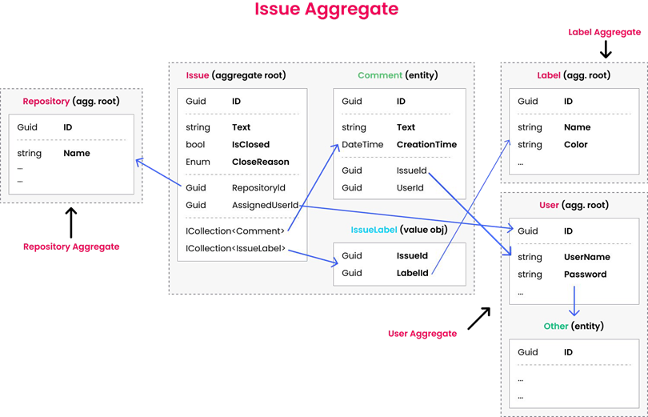

`Issue Aggregate` 由一个 `Issue Aggregate Root` 组成，其中包含 `Comment` 和 `IssueLabel` 集合。其他聚合只简单显示，因为我们将关注`Issue Aggregate`：


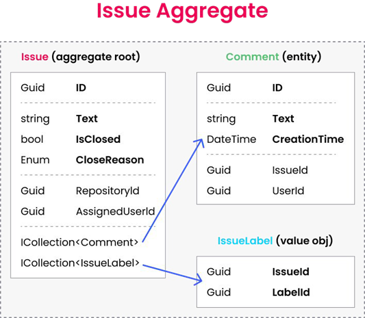


## 聚合

如前所述，[聚合](https://docs.abp.io/en/abp/latest/Entities)是由聚合根对象绑定在一起的一组对象（实体和值对象）。本节将介绍与聚合相关的原则和规则。


::: tip
除非我们明确编写聚合根或子集合实体，否则我们将术语实体称为聚合根和子集合实体。
:::


## 聚合/聚合根原则


### 业务规则

实体负责执行与其自身属性相关的业务规则。聚合根实体还负责其子集合实体。

聚合应该通过实施领域规则和约束来保持其**自我完整性**和**有效性**。这意味着，与 DTO 不同，实体具有**实现某些业务逻辑的方法**。实际上，我们应该尽可能地在实体中实现业务规则。


### 单个单元

聚合被检索并保存为一个单元，包含所有子集合和属性。例如，如果您想对`Issue`添加`Comment`，则需要；

- 从数据库中获取`Issue`，包括所有子集合（`Comments` 和 `IssueLabels`）。
- 使用`Issue` 类上的方法添加新评论，如`Issue.AddComment(...)`;。
- 将`Issue`（包括所有子集合）作为单个数据库操作（更新）保存到数据库。


对于以前使用 **EF Core 和关系数据库**的开发人员来说，这似乎很奇怪。获取所有`Issue`和细节似乎没有必要且效率低下。为什么我们不直接对数据库执行 SQL Insert 命令而不查询任何数据呢？

答案是我们应该在**代码**中**实现业务**规则并保持数据的**一致性**和**完整性**。如果我们有一个像“用户不能对锁定的问题发表评论”这样的业务规则，我们如何在不从数据库中检索的情况下检查问题的锁定状态？因此，只有在应用程序代码中相关对象可用时，我们才能执行业务规则。

另一方面，**MongoDB** 开发人员会发现这个规则很自然。在 MongoDB 中，聚合对象（带有子集合）保存在数据库中的**单个集合**中（而它分布在关系数据库中的多个表中）。因此，当您获得聚合时，所有子集合都已作为查询的一部分进行检索，无需任何额外配置。

ABP 框架有助于在您的应用程序中实现这一原则。


**示例：向问题添加评论**

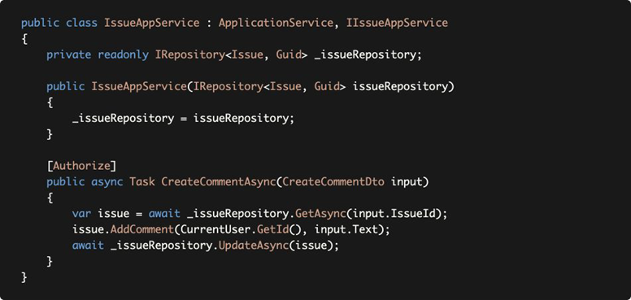

`_issueRepository.GetAsync` 方法默认将`Issue`及其所有详细信息（子集合）作为一个单元来检索。虽然这对 MongoDB 来说是开箱即用的，但您需要为 EF Core 配置聚合详细信息。但是，一旦您配置好，存储库就会自动处理它。 `_issueRepository.GetAsync` 方法获取一个可选参数 `includeDetails`，您可以在需要时传递 `false` 以禁用此行为。


::: tip
有关配置和替代方案，请参阅 [EF Core 文档](https://docs.abp.io/en/abp/latest/Entity-Framework-Core)的加载相关实体部分。
:::


`Issue.AddComment` 获取用户 ID 和评论文本，实现必要的业务规则并将评论添加到问题的 Comments 集合中。

最后，我们使用 `_issueRepository.UpdateAsync` 来保存对数据库的更改。


::: tip
EF Core 具有**更改跟踪**功能。因此，您实际上不需要调用 `_issueRepository.UpdateAsync`。由于 ABP 的工作单元系统会在方法结束时自动调用 `DbContext.SaveChanges()`，它将自动保存。但是，对于 MongoDB，您需要显式更新更改的实体。

因此，如果您想编写与数据库提供程序独立无关的代码，则应始终为更改的实体调用 `UpdateAsync` 方法。

:::


### 事务边界

聚合通常被视为事务边界。如果用例使用单个聚合，读取它并将其保存为单个单元，则对聚合对象所做的所有更改都将作为原子操作一起保存，并且您不需要显式数据库事务。

但是，在现实生活中，您可能需要在单个用例中更改**多个聚合实例**，并且需要使用数据库事务来确保**原子更新**和**数据一致性**。因此，ABP 框架针对用例（应用程序服务方法边界）使用显式数据库事务。有关更多信息，请参阅[工作单元](https://docs.abp.io/en/abp/latest/Unit-Of-Work)文档。


### 可序列化

聚合（带有根实体和子集合）应该作为一个单元在网络上可序列化和传输。例如，MongoDB 在保存到数据库时将聚合序列化为 JSON 文档，在从数据库读取时从 JSON 反序列化。


::: tip
当您使用关系数据库和 ORM 时，此要求不是必需的。然而，它是领域驱动设计的一个重要实践。
:::


以下规则已经带来了可序列化性。


### 聚合/聚合根规则和最佳实践

以下规则确保实施上述原则。


#### 仅通过 ID 引用其他聚合

第一条规则说一个聚合应该只通过它们的 Id 引用其他聚合。这意味着您不能将导航属性添加到其他聚合。

- 该规则使得实现可序列化原则成为可能。
- 它还可以防止不同的聚合相互操纵以及将聚合的业务逻辑相互泄露。

在下面的示例中，您会看到两个聚合根，`GitRepository` 和 `Issue`；


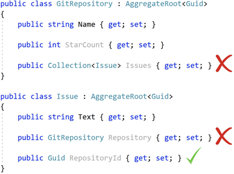

- `GitRepository` 不应该有`Issue`的集合，因为它们是不同的聚合。
- `Issue`不应具有相关 `GitRepository` 的导航属性，因为它是不同的聚合。
- `Issue` 可以有 `RepositoryId`（作为 Guid）。

所以，当你有一个`Issue`并且需要有与这个问题相关的 `GitRepository` 时，你需要通过 `RepositoryId` 从数据库中显式查询它。


#### 对于 EF Core 和关系数据库

在MongoDB中，自然不适合拥有这样的导航属性/集合。如果这样做，您会在源聚合的数据库集合中找到目标聚合对象的副本，因为它在保存时被序列化为 JSON。

但是，EF Core 和关系数据库开发人员可能会发现此限制性规则是不必要的，因为 EF Core 可以在数据库读取和写入时处理它。我们认为这是一项重要规则，有助于降低领域的复杂性，防止潜在问题，我们强烈建议实施此规则。但是，如果您认为忽略此规则是可行的，请参阅上面*关于数据库独立性原则*的讨论部分。


#### 保持聚合小规模

一个好的做法是保持聚合简单和小规模。这是因为聚合将作为单个单元加载和保存，并且读取/写入大对象存在性能问题。请参阅下面的示例：

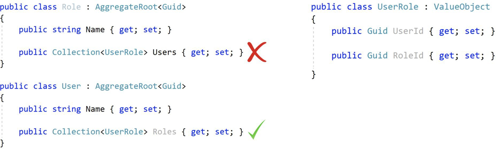

角色聚合具有一组 `UserRole` 值对象，用于跟踪为此角色分配的用户。请注意， `UserRole` 不是另一个聚合，并且它对于规则 *仅按 ID 引用其他聚合* 来说不是问题。然而，这在实践中是一个问题。在现实生活场景中，一个角色可能会分配给数千（甚至数百万）个用户，每当您从数据库中查询一个角色时，加载数千个项目是一个重大的性能问题（请记住：聚合由它们的子集合作为一个单元加载）。

另一方面， `User` 可能有这样一个 `Roles` 集合，因为用户实际上没有太多角色，并且在使用 User Aggregate 时拥有一个角色列表会很有用。

如果仔细想想，当使用非关系型数据库（如 MongoDB）时 Role 和 User 都有关系列表时，还有一个问题。在这种情况下，相同的信息会在不同的集合中重复，并且很难保持数据的一致性（每当您将项目添加到 `User.Roles` 时，您也需要将其添加到 `Role.Users`）。

因此，请根据以下考虑确定聚合边界和大小；

- 一起使用的对象。
- 查询（加载/保存）性能和内存消耗。
- 数据完整性、有效性和一致性。

在实践中；

- 大多数聚合根**不会有子集合**。
- 在大多数情况下，一个子集合中的项目不应超过 **100-150** 个。如果您认为一个集合可能包含更多项，请不要将集合定义为聚合的一部分，而是考虑为集合内的实体提取另一个聚合根。


#### 聚合根/实体上的主键

- 聚合根通常具有单个 `Id` 属性作为其标识符（Primark Key：PK）。我们更喜欢 `Guid` 作为聚合根实体的 PK（请参阅 [Guid 生成文档](https://docs.abp.io/en/abp/latest/Guid-Generation)以了解原因）。
- 聚合中的实体（不是聚合根）可以使用复合主键

例如，请参阅下面的聚合根和实体：


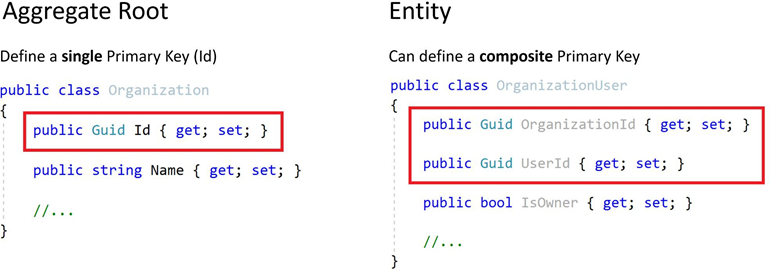

- `Organization` 有一个 `Guid` 标识符 (`Id`)。
- `OrganizationUser` 是一个 `Organization` 的子集合，并且有一个由 `OrganizationId` 和 `UserId` 组成的复合主键。

这并不意味着子集合实体应该始终具有复合 PK。需要时，它们可能具有单个 Id 属性。


::: tip
复合 PK 实际上是关系数据库的一个概念，因为子集合实体有自己的表，需要一个 PK。另一方面，例如，在 MongoDB 中，您根本不需要为子集合实体定义 PK，因为它们作为聚合根的一部分存储。
:::


#### 聚合根/实体的构造函数

构造函数位于实体生命周期开始的地方。设计良好的构造函数有一些责任：

- 获取**所需的实体属性**作为参数以**创建有效实体**。应该强制仅传递必需的参数，并且可能会获取非必需的属性作为可选参数。
- 检查参数的**有效性**。
- 初始化**子集合**。

**示例`Issue`（聚合根）构造函数**

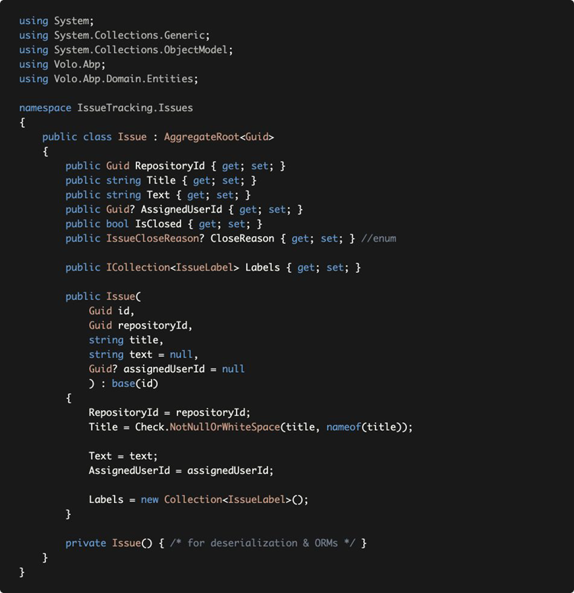


- `Issue`类通过在其构造函数中获取最少必需的属性作为参数来正确**强制创建有效实体**。
- 构造函数验证输入（如果给定值为空，`Check.NotNullOrWhiteSpace(...)` 抛出 `ArgumentException`）。
- 它会**初始化子集合**，因此当您在创建`Issue`后尝试使用 `Labels` 集合时，不会出现空引用异常。
- 构造函数也**接受** `id` 并传递给基类。我们不会在构造函数中生成 `Guid`，以便能够将此责任委托给另一个服务（请参阅 [生成Guid](https://docs.abp.io/en/abp/latest/Guid-Generation)）。
- ORM 需要私有的**空构造函数**。我们将其设为`private`以防止在我们自己的代码中意外使用它。


::: tip
请参阅[实体](https://docs.abp.io/en/abp/latest/Entities)文档以了解有关使用 ABP 框架创建实体的更多信息。
:::


#### 实体属性访问器和方法

你可能觉得上面的例子很奇怪！例如，我们强制在构造函数中传递一个非空的 `Title`。但是，开发人员随后可以在没有任何控制的情况下将 `Title` 属性设置为 `null`。这是因为上面的示例代码只关注构造函数。

如果我们使用公共 设置器声明所有属性（如上面的示例 `Issue` 类），我们无法强制实体在其生命周期中的有效性和完整性。所以;

- 当您在设置该属性时需要执行任何逻辑时，请为该属性使用**私有设置器**。
- 定义公共方法来操作这些属性。


**示例：以受控方式更改属性的方法**

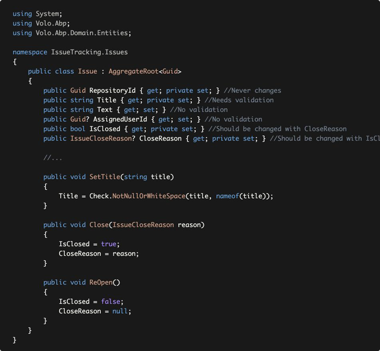

- `RepositoryId` 设置器设为私有，创建`Issue`后无法更改它，因为这是我们在此领域中想要的：问题不能移动到另一个存储库。
- 如果您想稍后以受控方式更改它，则将`Title` 设置器设为私有并创建 SetTitle 方法。
- `Text` 和 `AssignedUserId` 具有公共设置器，因为对它们没有限制。它们可以为 null 或任何其他值。我们认为没有必要定义单独的方法来设置它们。如果我们稍后需要，我们可以添加方法并使 设置器成为私有。领域层中的重大更改不是问题，因为领域层是一个内部项目，它不会暴露给客户端。
- `IsClosed` 和 `IssueCloseReason` 是对属性。定义 `Close` 和 `ReOpen` 方法来一起改变它们。通过这种方式，我们可以防止无故关闭问题。


#### 实体中的业务逻辑和异常

当您在实体中实现验证和业务逻辑时，您经常需要管理异常情况。在这些情况下；

- 创建**领域特定的异常**
- 必要时在实体方法中**抛出这些异常**。


**示例：**

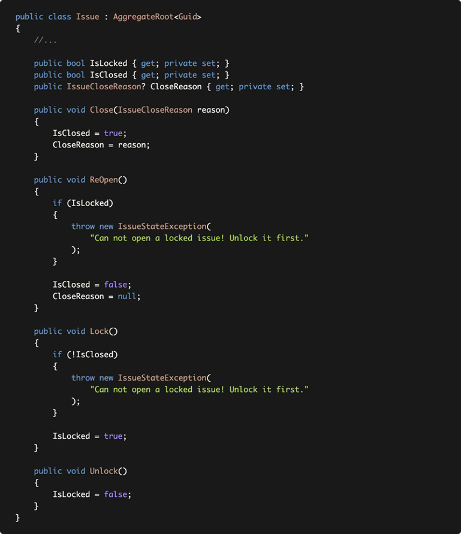

这里有两个业务规则；

- 无法重新打开锁定的问题。
- 您无法锁定未解决的问题。

在这些情况下，`Issue`类会抛出一个 `IssueStateException` 以强制执行业务规则：

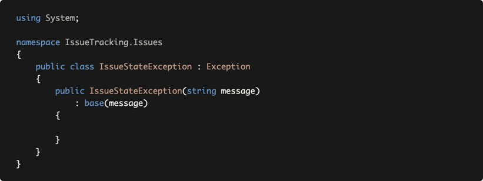

抛出这样的异常有两个潜在的问题；

1. 如果出现此类异常，**最终用户**是否应该看到异常（错误）消息？如果是这样，您如何**本地化**异常消息？您不能使用[本地化系统](https://docs.abp.io/en/abp/latest/Localization)，因为您不能在实体中注入和使用 `IStringLocalizer`。
2. 对于 Web 应用程序或 HTTP API，应该向客户端返回什么 **HTTP 状态码**？

ABP 的[异常处理系统](https://docs.abp.io/en/abp/latest/Exception-Handling)解决了这些和类似的问题。


**示例：使用代码抛出业务异常**


- `IssueStateException` 类继承了 `BusinessException` 类。对于从 `BusinessException` 派生的异常，ABP 默认返回 403（禁止）HTTP 状态代码（而不是 500 - 内部服务器错误）。
- 该`code`用作本地化资源文件中的关键字，用于查找本地化消息。


现在，我们可以更改 `ReOpen` 方法，如下所示：

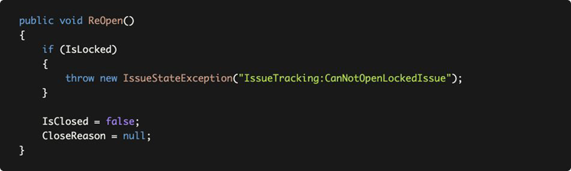


::: tip
使用常量而不是魔术字符串。
:::


并向本地化资源添加一个条目，如下所示：

```json
"IssueTracking:CanNotOpenLockedIssue": "Can not open a locked issue! Unlock it first."
```

- 当您抛出异常时，ABP 会自动使用此本地化消息（基于当前语言）向最终用户显示。
- 异常代码（这里是IssueTracking:CanNotOpenLockedIssue）也被发送到客户端，所以它可以以编程方式处理错误情况。


::: tip
对于此示例，您可以直接抛出 `BusinessException` 而不是定义专门的 `IssueStateException`。结果将是相同的。有关所有详细信息，请参阅[异常处理文档](https://docs.abp.io/en/abp/latest/Exception-Handling)。
:::


#### 在实体中需要外部服务的业务逻辑

///TODO

